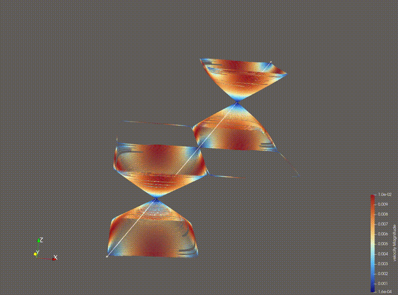

# AdvPT Programming Project - Oktal

Oktal is a C++23 adaptive octree library designed for computational physics and numerical simulations. It provides efficient spatial partitioning data structures commonly used in adaptive mesh refinement (AMR) for finite element and finite difference computations.



Taylor-Green vortex simulation at refinement level 7.
## Authors

- **Can Beydogan** (@eb99ykof)
- **Dennys Huber** (@ib84atit)

## Features

- **Morton Index Encoding**: Space-filling Z-order curve for efficient hierarchical spatial indexing
- **Adaptive Refinement**: Support for refined and phantom cells in the octree structure
- **Multiple Traversal Policies**: Pre-order depth-first and level-by-level (horizontal) iteration
- **Periodic Boundary Conditions**: Configurable torus topology with per-axis periodicity
- **CellGrid Abstraction**: Higher-level grid interface with pre-computed neighbor adjacency lists
- **VTK/HDF5 Export**: Visualization output via HighFive for scientific data analysis
- **Lattice Boltzmann Method**: D3Q19 lattice implementation with collision and streaming operators
- **Taylor-Green Vortex**: LBM simulation with analytical solution validation
- **Poisson Solver**: Example application demonstrating a Jacobi iterative solver

## Project Structure

```
oktal/
├── include/oktal/
│   ├── geometry/       # Vec, Box, PeriodicBox
│   ├── octree/         # MortonIndex, CellOctree, CellGrid, OctreeGeometry
│   ├── lbm/            # D3Q19, LbmKernels, TaylorGreen
│   └── io/             # VtkExport
├── src/                # Implementation files
├── tests/              # Test suite organized by task
└── apps/               # Applications (create-htgfile, poisson, tgv)
```

## Key Components

| Component | Description |
|-----------|-------------|
| `Vec<T, DIM>` | N-dimensional vector with arithmetic operations |
| `Box<T>` | Axis-aligned bounding box |
| `PeriodicBox` | Box with periodic boundary wrapping |
| `MortonIndex` | Z-order curve index for 3D hierarchical positions |
| `CellOctree` | Core octree with nodes, cursors, and iterators |
| `CellGrid` | Enumerated cell collection with adjacency lookup |
| `D3Q19Lattice` | 3D lattice with 19 velocity directions for LBM |
| `LbmKernels` | Collision, streaming, and macroscopic quantity kernels |
| `TaylorGreen` | Analytical solution for Taylor-Green vortex validation |
| `VtkExport` | Export utilities for visualization |

## Applications

### Poisson Solver

The `poisson` application solves the 3D Poisson equation using the Jacobi iterative method on a uniform octree grid.

#### Usage

```bash
./build/apps/poisson <refinementLevel> <max-iterations> <epsilon> <output-file>
```

**Parameters:**
- `refinementLevel`: Grid refinement level (e.g., 3 creates an 8×8×8 grid)
- `max-iterations`: Maximum number of Jacobi iterations
- `epsilon`: Convergence tolerance for the L2 residual norm
- `output-file`: Output VTK file path

**Example:**
```bash
./build/apps/poisson 4 1000 1e-6 poisson_solution.vtk
```

#### Output

The solver writes a VTK HDF file containing:
- `u`: Computed solution field
- `f`: Source term field
- `residual`: Final residual field

These can be visualized using ParaView or similar tools.

### Taylor-Green Vortex (TGV) Simulation

The `tgv` application simulates the Taylor-Green vortex flow using the Lattice Boltzmann Method (D3Q19) on a uniform octree grid with periodic boundary conditions.

#### Usage

```bash
./build/apps/tgv <refinement-level> <output-directory>
```

**Parameters:**
- `refinement-level`: Grid refinement level (minimum 5, e.g., 6 creates a grid with 262144 cells)
- `output-directory`: Directory where output files will be saved

**Example:**
```bash
./build/apps/tgv 6 output
```

#### Output

The simulation produces:
- Time series VTK HDF files (`step*.vtkhdf`) exported every 50 timesteps
- Final results file (`tgv_results.vtkhdf`) containing:
  - `density`: Fluid density field
  - `velocity`: Velocity field components
  - `velocity_error`: Error compared to analytical solution
- Error metrics file (`errors.txt`) with L2 errors for velocity components

#### Visualization

Results can be visualized using ParaView.

## Prerequisites

- CMake 3.31 or higher
- C++23 compatible compiler (Clang 19+ recommended)
- HDF5 and HighFive libraries (can be installed via Spack)

## Installing Dependencies via Spack

The project uses Spack to manage dependencies. The `spack.yaml` file in the project root defines the required packages.

### Setting up the Environment

1. **Create and activate the environment from the project root:**
```bash
spack env create oktal ./spack.yaml
spack env activate oktal
```

2. **Install the dependencies:**
```bash
spack install
```

Alternatively, you can create an independent environment directly in the project directory:
```bash
spack env activate --create .
spack install
```

### Using an Existing Lock File

To reproduce the exact environment from the lock file:
```bash
spack env create oktal ./spack.lock
spack env activate oktal
spack install
```

## Building the Project

### Compilation Steps

1. **Generate the build system:**
```bash
cmake -S . -B build -DCMAKE_BUILD_TYPE=Debug -DCMAKE_EXPORT_COMPILE_COMMANDS=ON
```

2. **Build the project:**
```bash
cmake --build build -j$(nproc)
```

### Build Options

| Option | Default | Description |
|--------|---------|-------------|
| `OKTAL_BUILD_TESTSUITE` | `ON` | Build the test suite |
| `CMAKE_BUILD_TYPE` | - | Build type: `Debug`, `Release`, `RelWithDebInfo` |

Example:
```bash
cmake -S . -B build -DOKTAL_BUILD_TESTSUITE=OFF -DCMAKE_BUILD_TYPE=Release
```

## Running Tests

After building, run the test suite:
```bash
ctest --test-dir build
```

To run specific tests by name pattern:
```bash
ctest --test-dir build -R <test-name-pattern>
```

To see verbose output:
```bash
ctest --test-dir build --output-on-failure
```

## Linting

Run clang-tidy on the project:
```bash
cd build
run-clang-tidy-19 -p .
```

## Cleaning

- **Clean build artifacts:** `cmake --build build --target clean`
- **Clean and rebuild:** `cmake --build build --clean-first`
- **Fresh configuration:** `rm -rf build && cmake -S . -B build`
